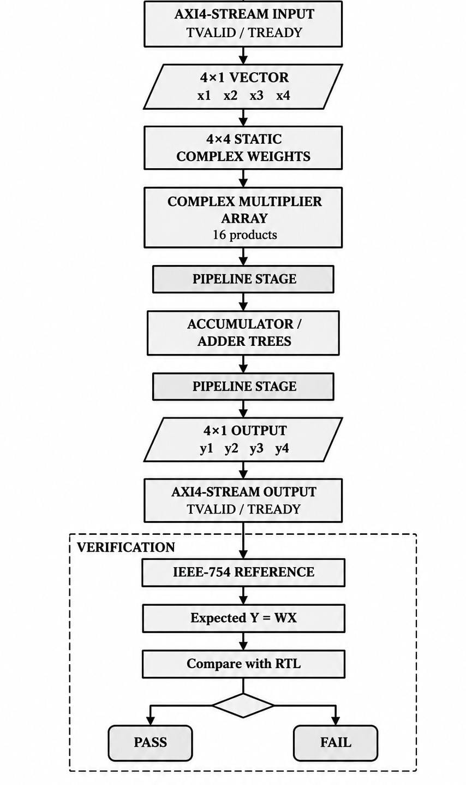
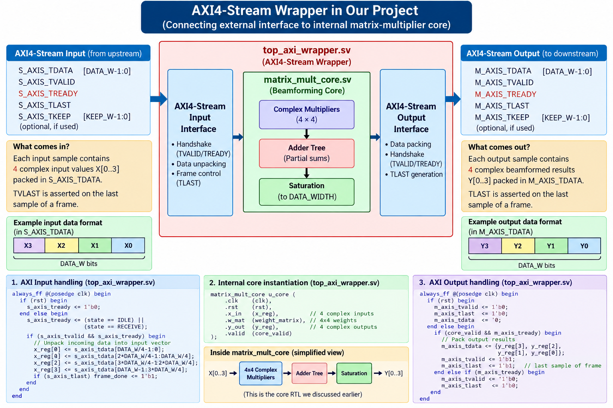
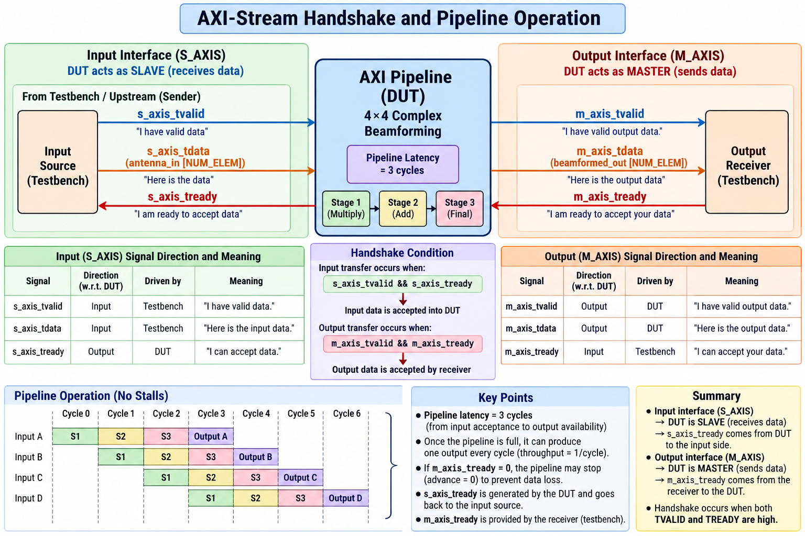
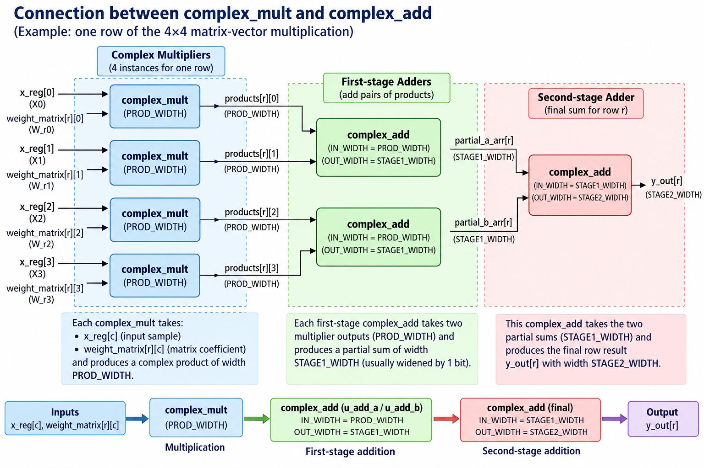

# AXI-Stream_-4x4-multiplier-for_Adaptive_Antenna_Array
Designed a pipelined 4×4 complex matrix multiplier for adaptive antenna beamforming with AXI4-Stream-style TVALID/TREADY flow control. Implemented complex multiply-accumulate datapaths and accumulator trees, and verified phase/amplitude accuracy against an IEEE-754 golden reference model.
## 1.Why this project is valuable 
| Part of your project | RTL skill you develop |
|---|---|
| 4×4 complex matrix multiplier | Datapath design, arithmetic architecture |
| Complex multiplication | Fixed-point/real-number arithmetic, multiplier design |
| Pipelining | Timing closure, latency management |
| Accumulator trees | Adder architecture, critical-path optimization |
| AXI4-Stream TVALID/TREADY | Handshake & backpressure logic |
| Real-time beamforming | Practical DSP hardware |
| Static weight matrix | Memory/register organization |
| IEEE-754 reference model | Golden-model based verification |
| Phase & amplitude checking | Numerical accuracy verification |
| SystemVerilog testbench | Verification methodology |

### Our whole project is totally based on this architecture

  

### Our total project flow is

  

## 2.Knowing about AXI stream (signals)
| AXI4-Stream Feature           | Usage in Your Project                                                                                                                                         |
| ----------------------------- | ------------------------------------------------------------------------------------------------------------------------------------------------------------- |
| **AXI4-Stream Interface**     | Connects the input antenna vector to the matrix multiplier and transfers the beamformed output using **TVALID/TREADY handshake**, with no addressing.         |
| **TVALID / TREADY Handshake** | Ensures data is transferred only when both the source is valid and the destination is ready, supporting **continuous and reliable streaming**.                |
| **128-bit TDATA**             | Carries the packed **complex antenna samples** at the input and the resulting complex beamformed data at the output.                                          |
| **Backpressure**              | If the output is not ready (`TREADY = 0`), the matrix multiplier holds the current output and prevents data loss.                                             |
| **Pipelined Data Flow**       | The 4×4 complex matrix multiplication is implemented as a **pipelined DSP datapath** to achieve efficient streaming operation.                                |
| **AXI4-Stream Master/Slave**  | The DUT acts as an **AXI4-Stream slave on the input** and an **AXI4-Stream master on the output**, transferring antenna data through the processing pipeline. |

### 2.1 AXI-Stream Wrapper 

  

The AXI4-Stream wrapper acts as the interface layer between the external AXI4-Stream bus and the internal 4×4 complex matrix multiplier. It unpacks the 128-bit TDATA into four complex input samples, connects the programmable weight storage to the matrix multiplier, and packs the four complex output samples back into TDATA. It also handles the TVALID/TREADY handshake, allowing reliable data transfer and flow control between the DUT and the external system.

### 2.2 AXI-Stream handshake and pipeline operation 

  

## 3.Connection between complex multiplier and complex adder (4x4 complex multiplication)

  

## 4.IEEE-754 Reference Verification
The testbench uses **IEEE-754 double-precision floating-point arithmetic as a golden reference model** to verify the fixed-point RTL implementation. The expected complex matrix multiplication results are calculated using high-precision real-valued arithmetic and compared with the RTL outputs to evaluate **amplitude and phase accuracy**, helping identify fixed-point quantization, rounding, and arithmetic errors while validating the correctness of the beamforming computation.

