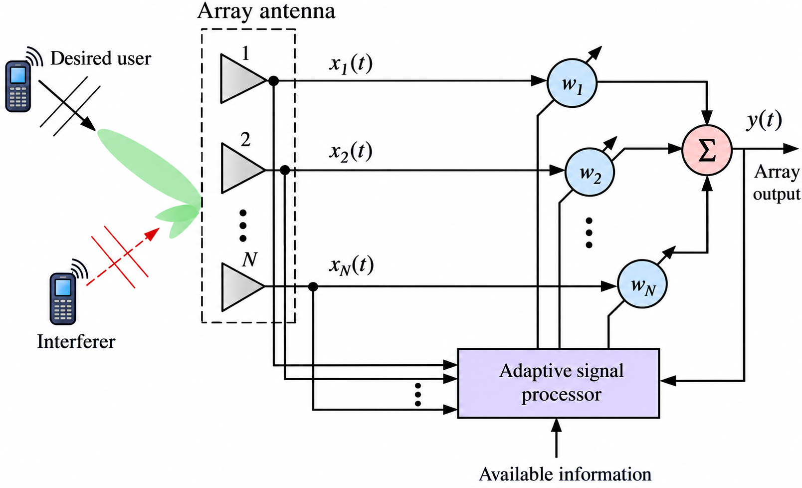

# AXI-Stream_-4x4-multiplier-for_Adaptive_Antenna_Array
Designed a pipelined 4×4 complex matrix multiplier for adaptive antenna beamforming with AXI4-Stream-style TVALID/TREADY flow control. Implemented complex multiply-accumulate datapaths and accumulator trees, and verified phase/amplitude accuracy against an IEEE-754 golden reference model.
## Why this project is valuable 
| Part of your project | RTL skill you develop |
|---|---|
| 4×4 complex matrix multiplier | Datapath design, arithmetic architecture |
| Complex multiplication | Fixed-point/real-number arithmetic, multiplier design |
| Pipelining | Timing closure, latency management |
| Accumulator trees | Adder architecture, critical-path optimization |
| AXI4-Stream TVALID/TREADY | Handshake & backpressure logic |
| Real-time beamforming | Practical DSP hardware |
| Static weight matrix | Memory/register organization |
| IEEE-754 reference model | Golden-model based verification |
| Phase & amplitude checking | Numerical accuracy verification |
| SystemVerilog testbench | Verification methodology |

### Our whole project is totally based on this architecture

